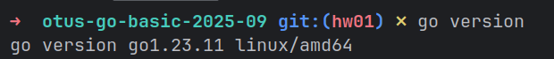
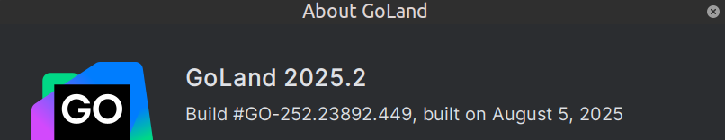
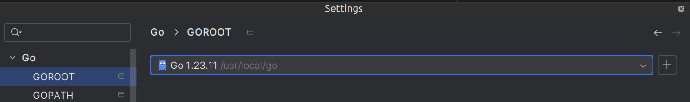
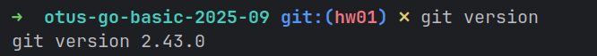
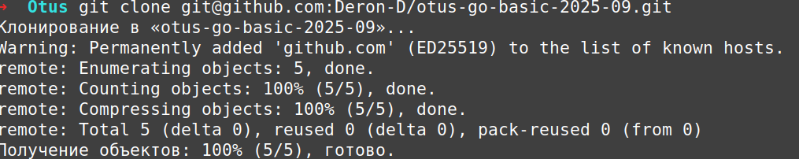
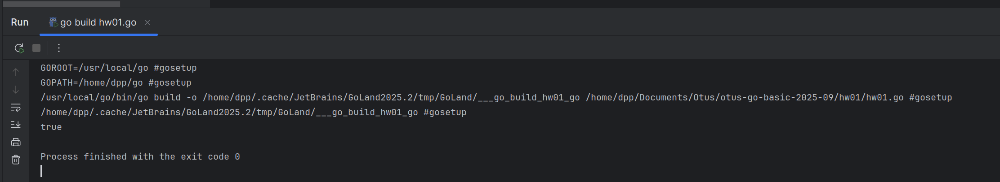

# **Лекция №1: Знакомство и начало работы с Go //ДЗ**
> _Golang_Developer_Basic_

## **Задание:**
Домашнее задание
Настройка окружения для разработки на Go

Цель:
Настроить самостоятельно среду для разработки на Go и систему контроля версиий;
Создать проект для домашних работ;
Попробовать самостоятельно поработать с новыми инструментами.

Описание/Пошаговая инструкция выполнения домашнего задания:
Установить Go SDK;
Установить и настройка IDE;
Создать учетную запись на Github;
Установить Git, Github Desktop;
Создать пустой публичный проект для домашних заданий;
Cклонировать проект на свое устройство;
Попробовать написать первые строчки в IDE кода и запустить.

Критерии оценки:
Реализована требуемая логика;
Проект собирается и запускается;

Статус ""Принято"" ставится при выполнении всех критериев;

Компетенции:
Настройка среды разработки
- работа с IDE (VS Code, Goland)
- установить Go SDK
- установить и настроить IDE
- создать учетную запись на Github
- установить Git, Github Desktop
---

## **Выполнено:**

1.Установлен Go SDK:

2.Установлен и настроен GoLand 2025.2:

 
3.В наличии учетка на GitHub:

4.Установлен `git`:

5.Создан пустой публичный проект для домашних заданий:

[https://github.com/Deron-D/otus-go-basic-2025-09](https://github.com/Deron-D/otus-go-basic-2025-09)

6.Cклонирован проект на свое устройство:

7.Написаны и запущены первые строчки в IDE [кода](./hw01.go):

